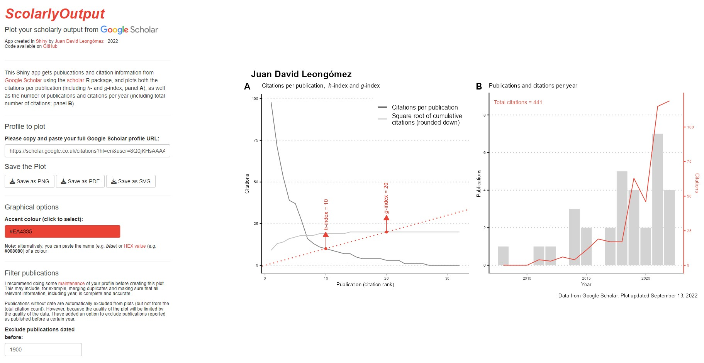

# ***ScholarlyOutput*** 
Grafica tus resultados académicos con el paquete [<code>scholar</code>](https://cran.r-project.org/web/packages/scholar/vignettes/scholar.html) de R. 

<!-- badges: start -->

[](https://github.com/JDLeongomez/ScholarlyOutput/blob/main/LICENSE)
[](https://zenodo.org/badge/latestdoi/536271372)
<!-- badges: end -->

**_ScholarlyOutput_** es una pequeña aplicación R Shiny para crear y exportar un gráfico completo de su perfil académico [**Google Scholar**](https://scholar.google.com/)

[](https://shiny.jdl-svr.lat/ScholarlyOutput_ES)

(**NOTE:** For the English version, go to https://github.com/JDLeongomez/ScholarlyOutput)

Sólo necesitas el enlace completo a tu perfil de Google Scholar (basta con copiarlo y pegarlo en el recuadro), y la app creará un gráfico con tu nombre (tal como aparece en tu perfil de Google Scholar) y dos paneles:

<ol type="A">
  <li><b>Citas por publicación</b>, incluyendo tanto tu índice h como, de manera importante, el <a href="https://es.wikipedia.org/wiki/G-index">índice g</a> (que nunca antes había visto en gráficos)</li>
  <li><b>Número de publicaciones y citas por año</b>, incluyendo el número total de citas</li>
</ol>

A continuación hay un ejemplo de la interfaz de usuario **_ScholarlyOutput_** que muestra una gráfica de mi propio perfil:



Puedes cambiar el color de acento y filtrar las publicaciones.


Una vez que estés satisfecho, la gráfica se puede exportar en formato **PNG**, **PDF** e incluso **SVG** en caso de que desees editarlo (el archivo descargado se llamará `Scholar_profile.png`, cambiando únicamente la extensión del archivo según el formato que hayas seleccionado).

El archivo descargado (en este caso, en formato PNG) se verá así:


Esta aplicación utiliza el fantástico paquete [<code>scholar</code>](https://cran.r-project.org/web/packages/scholar/vignettes/scholar.html) de R para extraer la información de tu perfil de Google Scholar, y luego varios paquetes (principalmente del conjunto de paquetes [<code>tidyverse</code>](https://www.tidyverse.org/), incluyendo [<code>ggplot2</code>](https://ggplot2.tidyverse.org/)) para manipular y representar estos datos.

## Cómo ejecutarlo localmente

Si bien esta aplicación está disponible en mi (bastante lento) servidor personal de [Shiny server](https://shiny.jdl-svr.lat/ScholarlyOutput_ES/), si es demasiado lento o mi servidor no está funcionando, siempre puedes ejecutarlo localmente en tu computadora con R instalado.

Simplemente puedes ejecutar el siguiente código en R:

```R
library(shiny)
runGitHub("ScholarlyOutput_ES", "JDLeongomez")
```
Alternativamente, siempre puedes clonar o [descargar](https://github.com/JDLeongomez/ScholarlyOutput_ES/archive/refs/heads/main.zip) el repositorio  **_ScholarlyOutput_** y ejecutar el archivo [<code>app.R</code>](https://github.com/JDLeongomez/ScholarlyOutput_ES/blob/main/app.R).

<details>
  <summary><b>Haz clic aquí para asegurarte de tener todos los paquetes necesarios instalados</b></summary>
<br>Por favor, ten en cuenta que el paquete <code>shiny</code> debe estar instalado. Otros paquetes de R utilizados en esta aplicación incluyen <code>thematic</code>, <code>shinythemes</code>, <code>colourpicker</code>, <code>stringr</code>, <code>scholar</code>, <code>dplyr</code>, <code>tidyr</code>, <code>ggplot2</code>, <code>ggpubr</code>, <code>scales</code> y <code>purrr</code>.<br><br>

Si lo deseas, puedes ejecutar primero el siguiente código, que verificará qué paquetes de estos ya están instalados en tu computadora e instalará los que falten (si los hay).

```R
# Paquetes requeridos
packages <- c("shiny", 
            "thematic", 
            "shinythemes", 
            "colourpicker", 
            "stringr", 
            "scholar", 
            "dplyr", 
            "tidyr", 
            "ggplot2", 
            "ggpubr", 
            "scales", 
            "purrr")
# Instalar paquetes aún no instalados
installed_packages <- packages %in% rownames(installed.packages())
if (any(installed_packages == FALSE)) {
 install.packages(packages[!installed_packages])
}
```
</details>

## Por qué hice esta pequeña aplicación 

Originalmente escribí un script para descargar datos de Google Scholar y hacer estos gráficos para una versión particular de mi Hoja de Vida. Sin embargo, a varios amigos les gustó y querían hacer gráficos de sus propios perfiles (y poder actualizarlos fácilmente), así que decidí convertir el código en una aplicación Shiny para que cualquiera pueda usarla.
